# FiveM Forum

This is a car dealership demo page made with the object of improving my skills as a developer. At this moment is under development so the demo page will be available on heroku soon.

### [View Demo](https://fivedemo.herokuapp.com/)

## Preview of the page (Home).

This is a preview of the landing page, you can read about the "company" or start looking for a disscussion that could help you instead.

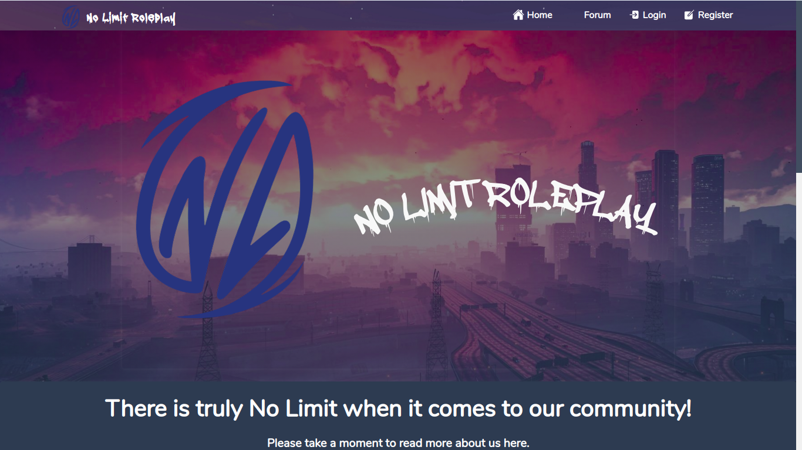

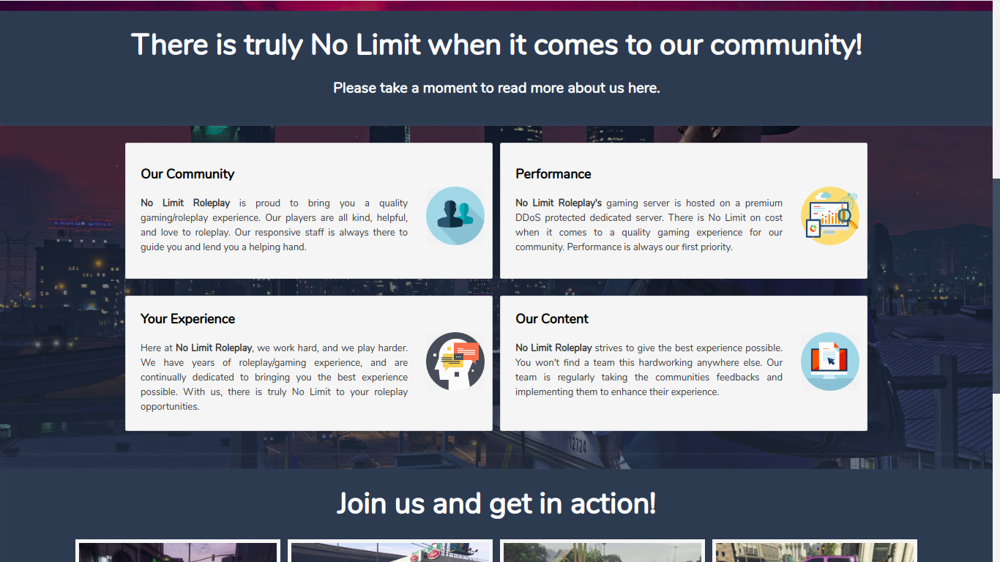

## Auth / Login / Register / Profile.

Using the default auth of laravel, just customized the default design with mine to fit with the whole website. Also added a profile view so the users can change some basics.

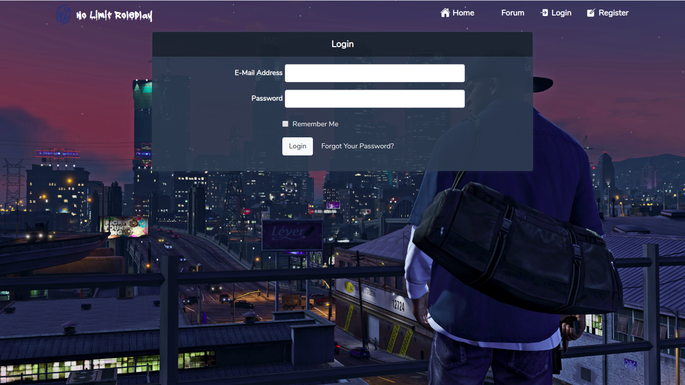

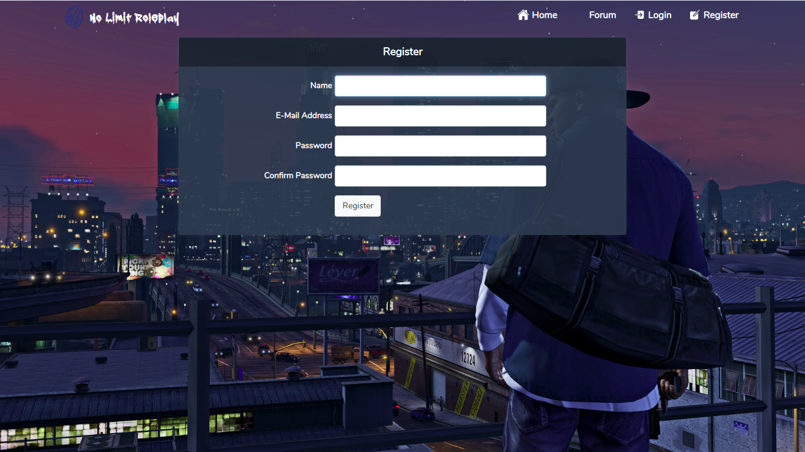

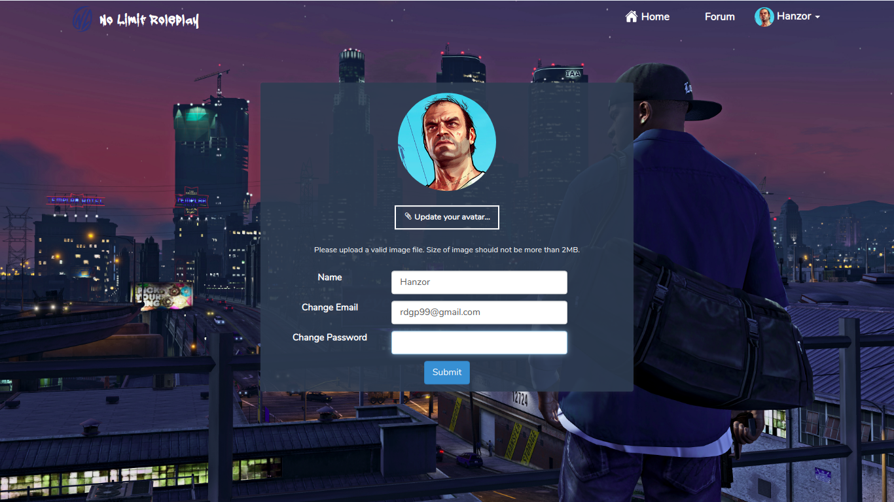

## Forum.

This section is where you can find what you are looking for, starting with disscussions related to any topic or you can just chat with other users in real time.

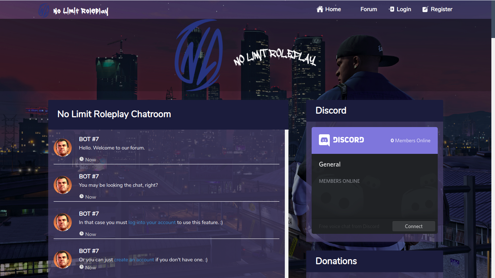

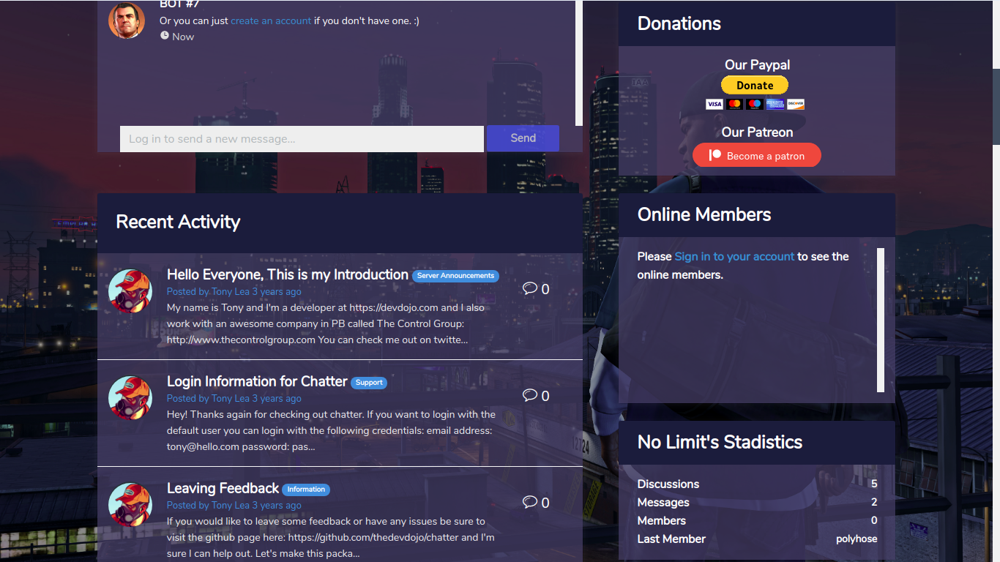

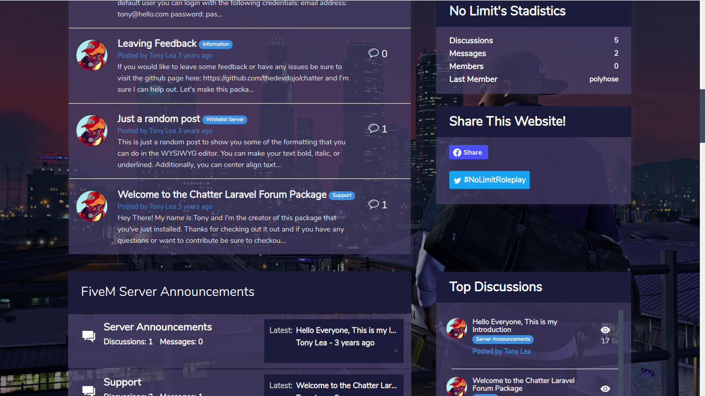

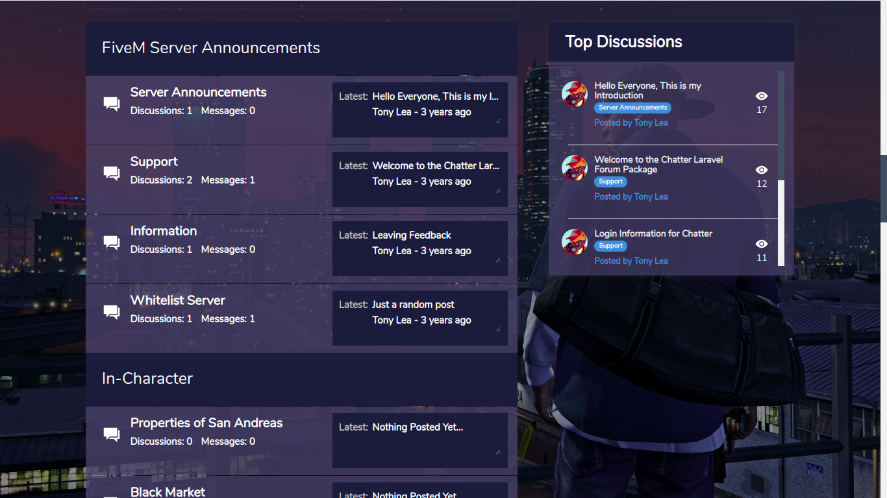

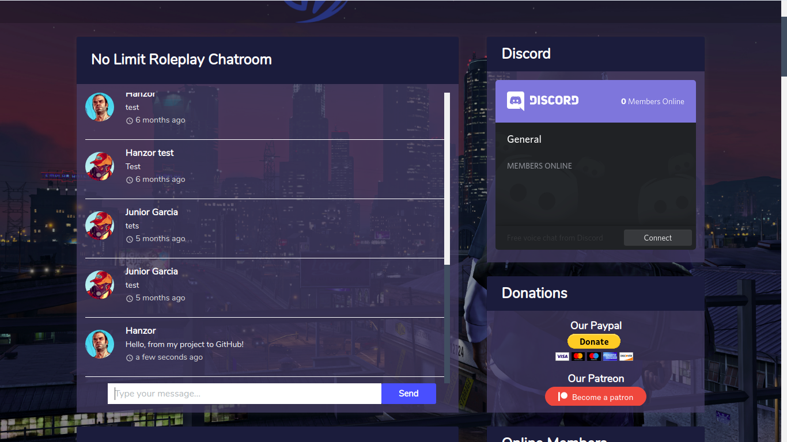

## Discussion.

This is where you can post a reply to any disscussion you decided to participate, nothing complicated, just a forum.

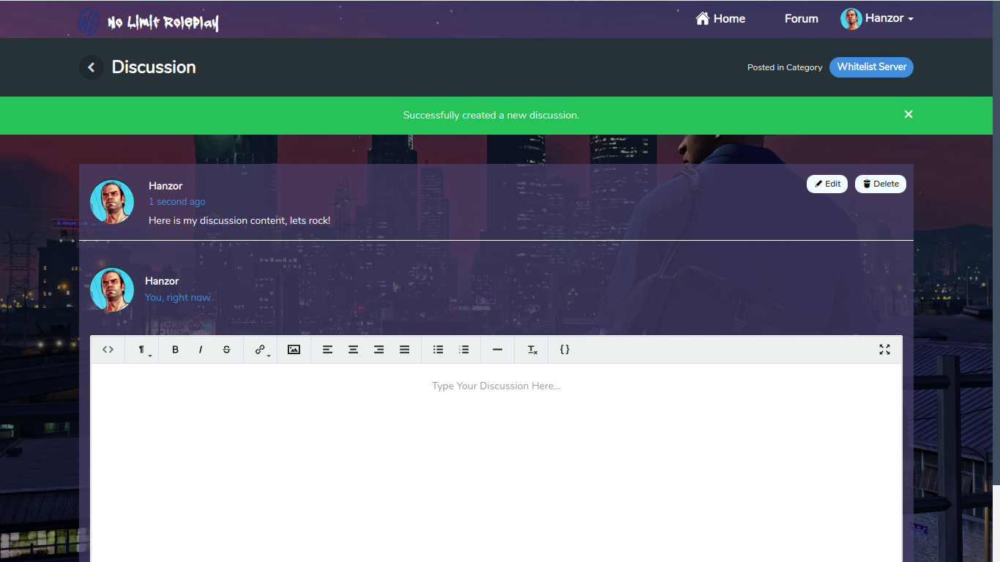

